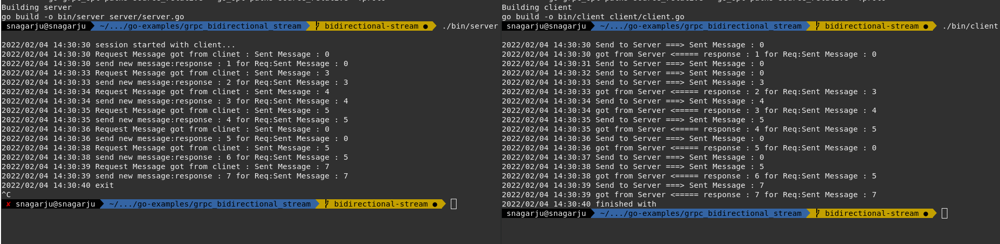

# grpc-example :  Bidirectional

In this example, there is no guarantee of msg processing between client and service.

**Note** reliable communication [example](https://github.com/Connect2naga/go-examples/tree/main/grpc/reliable_bidirectional_communication)
# execution
generate server binary, 50052 is the port
``` make 
 make server
 ./bin/server
--------------------------------------------logs ------------------------------------
  snagarju@snagarju  ~/.../go-examples/grpc_bidirectional_stream   bidirectional-stream ●  ./bin/server 
2022/02/04 14:30:30 session started with client...
2022/02/04 14:30:30 Request Message got from clinet : Sent Message : 0
2022/02/04 14:30:30 send new message:response : 1 for Req:Sent Message : 0 
2022/02/04 14:30:33 Request Message got from clinet : Sent Message : 3
2022/02/04 14:30:33 send new message:response : 2 for Req:Sent Message : 3 
2022/02/04 14:30:34 Request Message got from clinet : Sent Message : 4
2022/02/04 14:30:34 send new message:response : 3 for Req:Sent Message : 4 
2022/02/04 14:30:35 Request Message got from clinet : Sent Message : 5
2022/02/04 14:30:35 send new message:response : 4 for Req:Sent Message : 5 
2022/02/04 14:30:36 Request Message got from clinet : Sent Message : 0
2022/02/04 14:30:36 send new message:response : 5 for Req:Sent Message : 0 
2022/02/04 14:30:38 Request Message got from clinet : Sent Message : 5
2022/02/04 14:30:38 send new message:response : 6 for Req:Sent Message : 5 
2022/02/04 14:30:39 Request Message got from clinet : Sent Message : 7
2022/02/04 14:30:39 send new message:response : 7 for Req:Sent Message : 7 
2022/02/04 14:30:40 exit
^C

```

generate client and execute the binary
```
make client
./bin/client

---------------------------------------------------logs----------------------------------
2022/02/04 14:30:30 Send to Server ===> Sent Message : 0
2022/02/04 14:30:30 got from Server <===== response : 1 for Req:Sent Message : 0
2022/02/04 14:30:31 Send to Server ===> Sent Message : 0
2022/02/04 14:30:32 Send to Server ===> Sent Message : 0
2022/02/04 14:30:33 Send to Server ===> Sent Message : 3
2022/02/04 14:30:33 got from Server <===== response : 2 for Req:Sent Message : 3
2022/02/04 14:30:34 Send to Server ===> Sent Message : 4
2022/02/04 14:30:34 got from Server <===== response : 3 for Req:Sent Message : 4
2022/02/04 14:30:35 Send to Server ===> Sent Message : 5
2022/02/04 14:30:35 got from Server <===== response : 4 for Req:Sent Message : 5
2022/02/04 14:30:36 Send to Server ===> Sent Message : 0
2022/02/04 14:30:36 got from Server <===== response : 5 for Req:Sent Message : 0
2022/02/04 14:30:37 Send to Server ===> Sent Message : 0
2022/02/04 14:30:38 Send to Server ===> Sent Message : 5
2022/02/04 14:30:38 got from Server <===== response : 6 for Req:Sent Message : 5
2022/02/04 14:30:39 Send to Server ===> Sent Message : 7
2022/02/04 14:30:39 got from Server <===== response : 7 for Req:Sent Message : 7
2022/02/04 14:30:40 finished with


```


